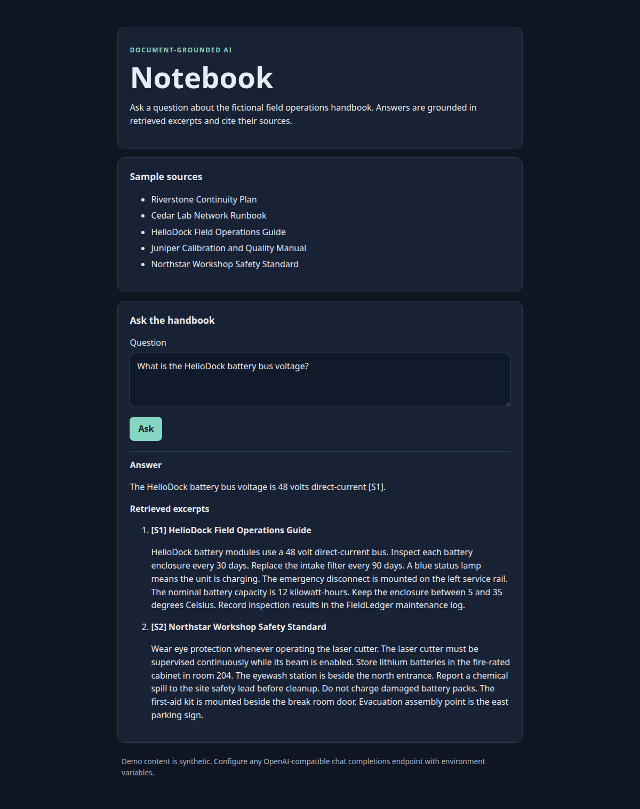

# Grounded chat walkthrough

The included handbook is fictional. The screenshots show an actual browser session against a local OpenAI-compatible model using only this synthetic material.

1. Follow the README setup and start the application on loopback port 5100.
2. Ask: `What is the HelioDock battery bus voltage?`
3. Inspect the answer marker and the retrieved excerpts. A marker mapping to a real source does not, by itself, establish that every claim is supported.
4. Ask a question absent from the handbook, such as `Who composed The Magic Flute?`, to exercise the no-match path.
5. Run the offline evaluation, then optionally configure a model and run the separate live evaluator.

The [mobile capture](demo-mobile.png) shows the same synthetic interaction at a 390-pixel viewport. Neither capture contains a real user's documents, account information, or infrastructure settings.

## Recorded development evaluation

[Live development results](live-development-results.json) retain the outputs from a single local backend on the 50 authored synthetic questions. This was a development evaluation, not a model comparison or hardware benchmark. Hardware/runtime commits and background load were not controlled.

- 40 answerable questions and 10 unanswerable questions.
- 42 model requests; 8 no-match questions bypassed generation.
- 39/40 answerable outputs passed the declared phrase check; all 40 referenced the expected source and used recognized citation markers.
- All 10 unanswerable pipeline cases abstained, including the 8 retrieval no-match cases.
- No endpoint errors or incomplete responses were recorded.

The one automated failure, `safety-06`, answered that damaged packs “must not be charged.” That is a supported paraphrase, but the declared string alternatives did not match it. The original automated score is retained; the rubric was not modified to improve this run's result. This illustrates why lexical grading must not be presented as semantic answer accuracy.

All outputs were reviewed for disclosure and compared with the synthetic source material by the release reviewer. This is not independent blinded adjudication. The set does not test conflicting documents, malicious source instructions, or generalization to real corpora. Published fixtures cannot serve as an uncontaminated blind benchmark.
