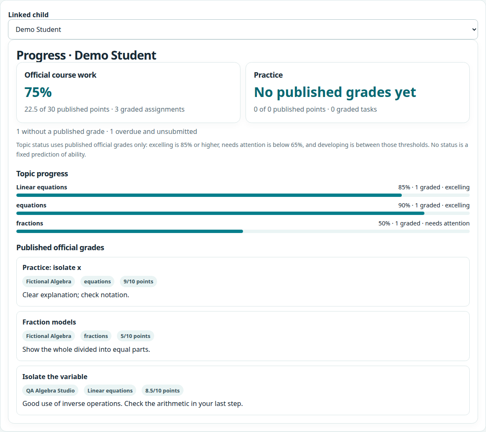

# Learning workspace

The `/learn/` area is a small, local demonstration of course workspaces for
teachers, students, parents, and tutors. Accounts are provisioned by a teacher
administrator; there is no public sign-up or role picker.

## Preview with invented records

Install the project and its development dependencies, then seed a new,
throwaway database and point the learning module at that same file:

```sh
uv sync --extra dev
uv run python -m app.learning.seed demo --db-path /tmp/notebook-learning-demo.sqlite3
export NOTEBOOK_LEARNING_DB_PATH=/tmp/notebook-learning-demo.sqlite3
uv run uvicorn app.main:app --host 127.0.0.1 --port 5100
```

Open `http://127.0.0.1:5100/learn/`. Port 8000 is commonly used by the
model endpoint configured through `OPENAI_BASE_URL`; keeping the app preview
on 5100 avoids sending tutor requests back to the app itself. The fictional accounts are
`demo-teacher`, `demo-student`, `demo-parent`, and `demo-tutor`; each uses the
password `Fictional-Demo-2026!`. These credentials are only for the invented
demo records. The demo command requires an explicit path, refuses a database
that already contains tables, and refuses the configured learning database.
Do not use these credentials with real information.

The parent view below is a capture of fictional demo data, including records
added during browser QA; it is not an exact rendering of the `seed demo`
database:



## Separate database and administrator setup

Learning data lives in its own SQLite file. `NOTEBOOK_LEARNING_DB_PATH` sets
that file; otherwise it defaults under `$XDG_DATA_HOME/notebook-learning/` or
`~/.local/share/notebook-learning/`. The adapter rejects a path equal to
`NOTEBOOK_DB_PATH`, the grounded-chat database setting. Only `learn_*` tables
are created in the learning database. Keep that file private and out of source
control; `.gitignore` excludes common SQLite files and sidecars.

To create a real teacher administrator, first select a new learning database,
then run the bootstrap command. It asks for a password without echoing it:

```sh
export NOTEBOOK_LEARNING_DB_PATH="$HOME/.local/share/notebook-learning/learning.sqlite3"
uv run python -m app.learning.seed bootstrap --username teacher --display-name 'Teacher'
```

The administrator creates other accounts and explicitly links parents to
students. Teachers own courses and official grading; tutors can create
targeted practice for assigned learners; students submit their work. Official
grades become visible to students, parents, and tutors only after a teacher
publishes them. Practice is tracked separately from official grades. Parents
may see aggregate practice progress, but practice feedback and submission text
are withheld.

## Model setup and limits

AI help uses the public app settings `OPENAI_BASE_URL`, `OPENAI_API_KEY`, and
`OPENAI_MODEL`. Learning-only overrides are available as
`NOTEBOOK_LEARNING_BASE_URL`, `NOTEBOOK_LEARNING_API_KEY`, and
`NOTEBOOK_LEARNING_MODEL`. Configure a compatible local or private endpoint
before asking for a tutor response. The application makes bounded requests;
errors and incomplete completions are reported without returning endpoint
details. Automated learning-AI tests use mocked completions. One bounded live
client smoke check is recorded in [LEARNING-SMOKE.md](LEARNING-SMOKE.md); it is
not a quality or performance evaluation. Tutoring receives only the
authorized lesson or assignment and that student's recent contextual chat. It
does not search the grounded-chat source library. Practice drafts are returned
for editing and are never published or graded automatically. Tutors can also
start a blank manual draft without a model request when the configured endpoint
is unavailable.

Progress summarizes published, valid work. Ungraded work is not counted as a
zero. Topic labels are descriptive thresholds (85% or above, below 65%, and
between those values), not validated predictions of ability. Explanation
preferences can be changed at any time; they are presentation choices, not
fixed learning styles. A citation marker shows which provided item the model
named; it does not prove that the explanation is supported. Humans remain
responsible for reviewing explanations, drafts, submissions, and grades.

## Scope

This release is a local demonstration, not a production school service. There
is no interface or API for editing or revoking parent links, enrollments, tutor
assignments, courses, lessons, or assignments; correcting those records
currently requires direct database administration. Keep
the server bound to localhost for a preview. Do not expose the complete demo
application as a public service: the separate learning login does not turn the
grounded-chat endpoints into an authenticated product. A real deployment needs
an independently reviewed hosting, transport-security, account-recovery,
back-up, and operational plan. Tests and preview data are fictional and do
not exercise a real model unless an operator explicitly configures one.

## Verification

The focused browser walkthrough used a temporary learning-only SQLite file and
deterministic mocked AI completions. It verified teacher course setup, student
submission and preference changes, parent progress visibility, and tutor AI
draft review and publication. The tutor's blank manual-draft path also
published a reviewed lesson and practice assignment without making an AI
request. Missing tutor context returned a safe validation error. At desktop
1440px and mobile 390px viewport widths, the check found no horizontal
overflow or browser JavaScript errors. This workflow check does not establish
live-model behavior or a production deployment.
